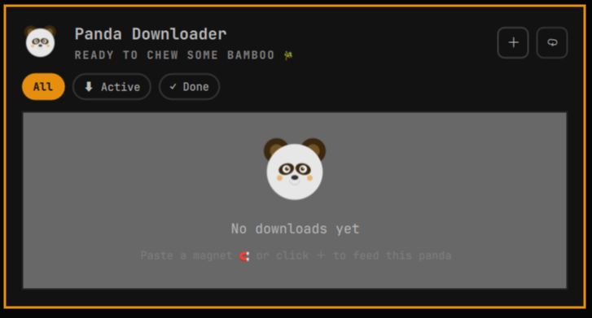
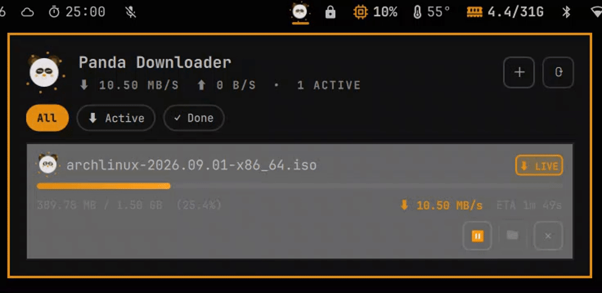

# Omarchy Panda Downloader

<p align="center">
  
</p>

<p align="center">
  <strong>Native Omarchy status bar widget and control panel for multi-part downloading and BitTorrent.</strong>
</p>

<p align="center">
  
  
  
  
</p>

---

## Overview

The **Omarchy Panda Downloader** brings high-speed file downloading and torrent management directly to your Omarchy status bar. Easily capture links, manage multi-part downloads, and handle magnet links without opening a dedicated desktop window.

Designed natively for **Omarchy Linux** and **Hyprland**, it integrates seamlessly into your environment, adapting to your current system theme and providing an intuitive quick-access panel.

---

## Visual Showcase

<div align="center">

| **Panel Overview** | **Downloading Action** |
| :---: | :---: |
|  |  |
| *Quick access to all your downloads* | *High-speed multi-part file downloading* |

</div>

---

## Features

- 🚀 **Multi-Part Downloader**: High-speed parallel file downloading.
- 🧲 **BitTorrent & Magnet Links**: Built-in lightweight torrent support.
- 📋 **Auto-Capture**: Automatically captures supported download links from your clipboard.
- 🎨 **Omarchy Integration**: Native Omarchy bar widget with a beautiful drop-down panel.

---

## Powered by `panda-dl`

This widget acts as a seamless graphical frontend for the **[`panda-dl` CLI](https://github.com/pandaind/panda-dl)**. All core capabilities—such as high-speed multi-part downloading and BitTorrent handling—are powered entirely by this backend engine.

---

## Installation

Install directly with a single Omarchy command:

```bash
omarchy plugin add https://github.com/pandaind/omarchy-panda-dl.git --enable
```

> [!TIP]
> This command automatically downloads, validates, and places the widget on your Omarchy status bar.

### Manual Installation (Optional)

If you prefer manual setup:

1. Clone the repository into your Omarchy user plugins directory:
   ```bash
   git clone https://github.com/pandaind/omarchy-panda-dl.git ~/.config/omarchy/plugins/omarchy-panda-dl
   ```

2. Add `"panda-dl"` to your desired bar section in `~/.config/omarchy/shell.json`:
   ```json
   {
     "bar": {
       "layout": {
         "right": [
           { "id": "panda-dl" },
           { "id": "omarchy.tray" },
           { "id": "omarchy.network" },
           { "id": "omarchy.audio" },
           { "id": "omarchy.power" }
         ]
       }
     }
   }
   ```

3. Reload the shell:
   ```bash
   omarchy-shell shell rescanPlugins
   # or
   omarchy restart shell
   ```

### Uninstallation

To remove the plugin:

```bash
omarchy plugin remove panda-dl
```

For manual installations, remove the directory and reload the shell:

```bash
rm -rf ~/.config/omarchy/plugins/omarchy-panda-dl
omarchy restart shell
```

---

## Requirements

- **Omarchy Linux** (with Hyprland & Quickshell)

---

## License

- Licensed under the [MIT License](LICENSE).
